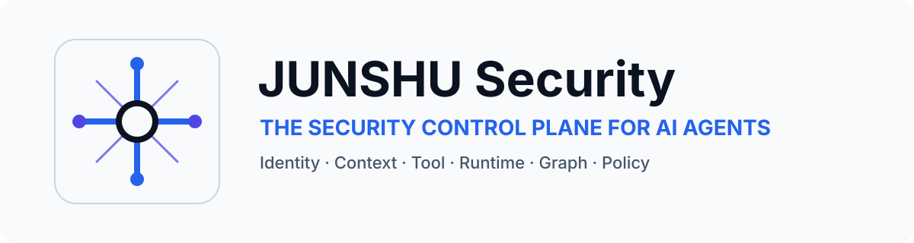
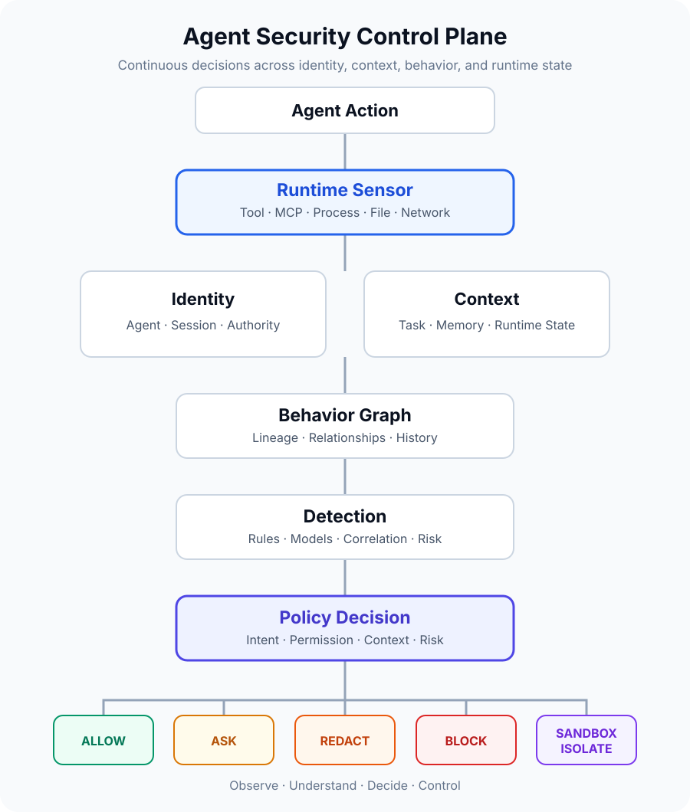

<div align="center">

<picture>
  <source media="(prefers-color-scheme: dark)" srcset="./hero-dark.svg">
  <source media="(prefers-color-scheme: light)" srcset="./hero-light.svg">
  
</picture>

# JUNSHU Security

### Security at the Point of Execution.

**Open Agent Runtime Security Platform**

Open-source security infrastructure for AI agents, coding agents, MCP, tools, and autonomous runtime.

JUNSHU observes, understands and controls what AI agents actually do.

<code>Agent Runtime Security</code>&nbsp; <code>Coding Agent Security</code>&nbsp; <code>MCP Security</code>&nbsp; <code>Open Source</code>

**Observe &rarr; Understand &rarr; Decide &rarr; Enforce**

</div>

## AI Agents Are Becoming Execution Environments

They read files, write code, execute shell commands, call APIs, access credentials, use MCP tools, control browsers, and delegate work to other agents.

JUNSHU Security brings security into that execution path. The platform direction is to correlate identity, intent, context, memory, tools, behavior, and runtime activity so security decisions can be made before autonomous actions create real-world impact.

> **Secure agents where they execute, not only where they call the model.**

> **Public status:** This namespace currently contains brand and community infrastructure only. Product repositories, integrations, and runtime capabilities described below are `Planned` or `Research` until public implementation and release evidence is available.

## Agent Integration Roadmap

`Codex` **Planned** &nbsp;·&nbsp; `Claude Code` **Planned** &nbsp;·&nbsp; `MCP-native agents` **Planned** &nbsp;·&nbsp; `Custom agents` **Planned**

The initial integration focus is coding agents because their execution surface includes repositories, shells, package managers, browsers, networks, MCP servers, developer credentials, cloud systems, and CI/CD. Additional runtimes will be opened progressively.

## Why JUNSHU

| Principle | Direction |
| --- | --- |
| **Runtime-native** | Put controls in the agent execution path, not only around the model API |
| **Agent-aware** | Evaluate intent, plans, context, memory, identity, tools, permissions, and history together |
| **Inline enforcement** | Support allow, ask, approve, rewrite, mask, down-scope, or block decisions before execution |
| **Defense in depth** | Combine rules, identity, permissions, context, runtime signals, behavior, graphs, and models |
| **Security graph** | Correlate users, agents, tools, credentials, resources, actions, findings, and decisions |
| **Traceable decisions** | Preserve task, trace, span, evidence, risk labels, and policy context |
| **Human in the loop** | Pause risky actions, request a decision, and safely resume the original task |
| **Learning loop** | Turn findings and hard cases into datasets, evaluations, and improved detection |

## Built for Agents That Can Act

Modern agents do more than generate text. Coding agents can read repositories, modify files, execute commands, install packages, access credentials, call APIs, use MCP servers, and operate external systems. JUNSHU is designed to move security controls into this execution path.

```text
User Intent -> Agent -> Plan -> Context / Memory
                              |
            +-----------------+-----------------+
            |                 |                 |
         Shell / Code      File / Git       MCP / API
            |                 |                 |
         Process          Credential        Browser
            +-----------------+-----------------+
                              |
                       JUNSHU Runtime
                              |
                 Continuous Security Decision
```

## Agent Security Control Plane

<picture>
  <source media="(prefers-color-scheme: dark) and (max-width: 600px)" srcset="./control-plane-mobile-dark.svg">
  <source media="(prefers-color-scheme: light) and (max-width: 600px)" srcset="./control-plane-mobile-light.svg">
  <source media="(prefers-color-scheme: dark)" srcset="./control-plane-dark.svg">
  <source media="(prefers-color-scheme: light)" srcset="./control-plane-light.svg">
  
</picture>

This is not only a `Prompt -> Model -> Output Filter` pipeline. The intended control plane follows an agent as runtime context changes and actions move toward execution.

| Observe | Understand | Decide | Enforce |
| --- | --- | --- | --- |
| Intent and plans | Identity and authority | Detection signals | Allow or log |
| Tool and MCP calls | Context and memory | Risk aggregation | Ask or approve |
| Files and processes | Behavior and history | Policy evaluation | Rewrite or mask |
| Browser and network | Graph relationships | Decision evidence | Down-scope or block |

## Full Agent Execution Context

A risky action rarely begins with the tool call itself. JUNSHU's direction is to correlate user intent, agent plans, retrieved context, memory, permissions, tool selection, execution results, and historical behavior before making a security decision.

```text
USER INPUT -> MODEL REQUEST -> MODEL RESPONSE -> AGENT PLAN
     -> RAG / CONTEXT -> MEMORY -> TOOL SELECTED
     -> PRE-TOOL SECURITY -> TOOL CALL -> TOOL RESULT
     -> POLICY DECISION -> FINAL RESPONSE -> TRAJECTORY DIAGNOSIS
```

## More Than an AI Gateway

JUNSHU is not just another AI gateway. The planned architecture can enter the execution path through agent adapters, runtime hooks, an SDK, security APIs, MCP integration, telemetry, and runtime sensors.

```text
Agent Adapter -> Runtime Hook ----+
Security SDK -> Security API -----+-> Unified Event Model
MCP Integration -> Tool Runtime --+          |
                                           v
                                  Security Control Plane
```

## Runtime Execution Surface

| Domain | Execution context |
| --- | --- |
| **Agent** | User intent, plan, state, delegation, sub-agents |
| **Model** | Model request, response, and system context |
| **Context** | RAG, retrieved documents, external data, provenance |
| **Memory** | Reads, writes, mutation, and poisoning signals |
| **Tools** | Discovery, selection, arguments, execution, and results |
| **Runtime** | Shell, Python, Node.js, code, files, and processes |
| **MCP** | Servers, schemas, `tools/list`, `tools/call`, resources, and results |
| **External systems** | HTTP, APIs, databases, repositories, browsers, networks, and webhooks |

## Runtime Risk Detection

No individual risk area is presented as production-ready in this namespace.

| Status | Focus |
| --- | --- |
| **Planned** | Dangerous shell execution, unsafe code execution, unauthorized tool use, privilege escalation, credential leakage, sensitive data exposure, data exfiltration, MCP tool risk, and policy bypass |
| **Research** | Indirect prompt injection, agent data injection, goal drift, intent/action misalignment, RAG or memory poisoning, over-delegation, and suspicious sub-agent behavior |

## Multi-Engine Detection Architecture

JUNSHU's technical direction combines independent security engines instead of relying on a single rule engine or LLM judge. No public engine-count claim is made before implementation artifacts are released.

```text
                         Security Event
                               |
                        Detection Router
                               |
     +-------------+-----------+-----------+-------------+
     |             |           |           |             |
   Rules        Identity    Semantic    Behavior      Runtime
     |          Permission   Context     Graph        Command
     +-------------+-----------+-----------+-------------+
                               |
                        Risk Aggregation
                               |
                         Policy Decision
```

## Inline Runtime Enforcement

The planned policy model goes beyond `ALLOW / BLOCK`. It is designed to preserve useful autonomy while adding proportionate control.

```text
Agent Action -> Runtime Context -> Detection -> Policy Decision
                                                |
             +----------+----------+-------------+----------+
             |          |          |             |          |
           ALLOW     ASK USER   APPROVAL      REWRITE     MASK
             |          |          |             |          |
           LOG ONLY   PAUSE      RESUME       DOWN-SCOPE  BLOCK
```

### Human-in-the-Loop Runtime Control

The `ASK USER` direction is to interrupt a high-risk action before execution, present the evidence and proposed action, accept an approval or safer modification, and then resume the original agent task. This capability remains **Planned** until a public integration demonstrates it end to end.

## Identity × Context × Behavior × Runtime

The same command can be safe for one agent and dangerous for another. A runtime decision should understand who authorized the agent, the user's intent, the plan, effective permissions, data involved, destination, tool, resource, and earlier events in the trace.

```text
Identity (who) + Context (why) + Behavior (what changed) + Runtime (what executes)
                                      |
                                      v
                              Continuous Risk
```

## Agent Security Graph

The planned graph connects `User`, `Identity`, `Agent`, `Session`, `Task`, `Plan`, `Sub-Agent`, `MCP Server`, `Tool`, `Capability`, `Credential`, `File`, `Process`, `Network`, `API`, `Database`, `RAG`, `Memory`, `Policy`, `Finding`, and `Decision`.

```text
User -> Agent -> Task -> Plan -> Tool -> Credential -> Resource
 |        |       |       |       |          |            |
Identity  Session Trace  Policy Capability  Finding   Destination
```

JUNSHU aims to turn isolated agent events into a continuously evolving security graph. Security decisions should understand relationships, not only individual prompts.

## Every Decision Has Context

The planned trace model correlates `traceId`, `spanId`, `parentSpanId`, `decisionId`, risk labels, evidence, and policy version across the execution timeline.

```text
User Intent -> Agent Plan -> Tool Selection -> Security Decision
                                                  |
                                                  v
                            Tool Execution -> Tool Result -> Replay
```

## Security AI Lab

Runtime findings should not end as alerts. The research direction is a feedback loop that turns agent behavior, hard cases, and findings into versioned datasets, scenarios, labels, evaluations, models, and improved detection engines.

```text
Runtime -> Finding -> Hard Case -> Dataset -> Scenario -> Label
   ^                                                    |
   |                                                    v
Improved Detection <- Engine Binding <- Evaluation <- Learn
```

**Observe -> Decide -> Enforce -> Trace -> Diagnose -> Learn**

## Public Capability Status

| Capability | Status |
| --- | --- |
| Profile, brand assets, and community security policy | **Available** |
| Codex adapter | **Planned** |
| Claude Code adapter | **Planned** |
| Runtime telemetry and trace | **Planned** |
| Pre-tool enforcement and policy engine | **Planned** |
| Human approval / `ASK USER` | **Planned** |
| Multi-engine detection | **Planned** |
| Agent Security Graph | **Planned** |
| MCP runtime security | **Planned** |
| Security AI Lab and learning loop | **Research** |

## Open Source Roadmap

No release dates or production-readiness claims are implied.

| Repository | Purpose | Suggested language | License direction | Status |
| --- | --- | --- | --- | --- |
| `agentsec` | Security control plane and shared contracts | Go | Apache-2.0 | Planned |
| `runtime` | Runtime sensing, enforcement, and isolation | Rust | Apache-2.0 | Planned |
| `sdk` | Integration contracts and client libraries | Multi-language | Apache-2.0 | Planned |
| `engines` | Detection and risk evaluation | Python | Apache-2.0 | Planned |
| `agent-graph` | Runtime entities, lineage, and correlation | Rust | Apache-2.0 | Planned |
| `mcp-security` | MCP server, tool, and resource security | TypeScript | Apache-2.0 | Planned |
| `adapters` | Codex, Claude Code, MCP, and future runtime adapters | Multi-language | Apache-2.0 | Planned |
| `examples` | Framework and runtime integration patterns | Multi-language | Apache-2.0 | Planned |
| `benchmark` | Reproducible security scenarios and metrics | Python | Apache-2.0 | Planned |
| `datasets` | Curated evaluation and research data | Data | CDLA-Permissive-2.0 | Planned |
| `docs` | Architecture, threat models, and operator guides | Markdown | CC-BY-4.0 | Planned |

Repository names stay short because the GitHub namespace already carries the brand. Empty product repositories will not be created ahead of real releases.

## Security Philosophy

> **The model proposes. The runtime acts. Security must govern the action.**

Once an agent can affect files, processes, credentials, browsers, tools, APIs, or other agents, the effective security boundary moves from the model to the runtime.

## Community and Security

- Read the [contribution guidelines](https://github.com/ScalePivot/.github/blob/main/CONTRIBUTING.md) before proposing a change.
- Follow the [Code of Conduct](https://github.com/ScalePivot/.github/blob/main/CODE_OF_CONDUCT.md) in all project spaces.
- Use the [support guide](https://github.com/ScalePivot/.github/blob/main/SUPPORT.md) to choose the right channel.
- Report vulnerabilities privately according to the [security policy](https://github.com/ScalePivot/.github/blob/main/SECURITY.md). Do not disclose vulnerabilities in public issues.

---

<div align="center">

**JUNSHU Security · 钧枢安全**

Security at the Point of Execution.

<sub>JUNSHU Security brand marks and project identifiers are not licensed for endorsement, impersonation, or use by unrelated products.</sub>

</div>
